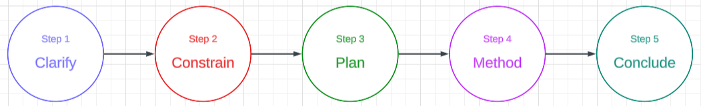

An **open-ended** problem based on a real-life data science project:
- An opening question with 1 to 3 follow-up questions
- **Duration**: 10 to 20 minutes
- **Topics**: Statistics, Machine Learning, AB Testing, Product-Sense
- **Domain**: Company x Team x Role

### Response Framework 
Provide an effective response in 5 steps.

### Example
Data Scientist, Marketing @ Apple  
- How would you find meaningful segmentations of Apple's customers?

**Step 1:** Clarify
- What is the business objective of the segmentations? Is the application for product research or marketing?
- Should I focus on customers across Apple's business or within a specific business such as Apple Pay or Apple Music?

**Step 2:** Constrain the open-ended problem into a key objective 
Based on your clarifications, I will focus on segmenting users based on subscription services such as Apple Music, Apple TV+, and iCloud. The purpose is to help Apple's marketing team create customer profiles that can help the perform target marketing.

**Step 3:** Plan - Take a minute ot two to frame your response
- I would like to take a minute to gather my thoughts on a solution if that's okay with you.
- To address this problem, I would like to discuss data preparation, statistical methos and a business recommendation. Are you okay with this?

**Step 4:** Method
- First, I need to prepare data that are useful for the segmentaions. I could use user profile, user behavior, and marketing engagement data.
- Next, I will apply feature engineering to extract useful signals. For instance, I could extract # of active sessions per Apple Music in the past 30 days. I can repeat the feature engineering on other subscription services. Such signals can help create what types of services a user typically uses.
- With the features identified, I can apply a clustering algorithm such as the K_means. I can use the Elbow technique to find the optimal number of clusters. Finally, I can interpret each cluster using descriptive statistics to create user profiles.

**Step 5:** Conclude by relating the methodology to the buisness problem:
- With the clusters identified, I can provide a description of each cluster type. For instance, if a cluster conatins users with low-frequency active sessions across Apple;s services, the marketing team could send a targeted email campaign to encourage users to stay engaged on the services.

### Evaluation Process
#### How does an interviewer evaluate a candidate?
1. **Questions** - What were the problems asked?
2. **Summary** - What was the candidate's response? 
3. **Assessment** - What were the strengths and weaknesses of the response?
4. **Grading Rubric** - What were the ratings for each attribute? Why?
5. **Hiring Decision** - What is the recommendation to the hiring committee?

### Assessment
#### How does an interviewer evaluate a candidate?
- **Structure** - Was the candidate's response structured or unfocused?
- **Completeness** - Did the candidate complete the solution?
- **Soundness** - Was the methodology sensible?
- **Clarity** - Did the candidate explain clearly?
- **Speed** - How quickly did the candidate provide a response?

### Preparation Strategy
#### How does an interviewer evaluate a candidate?
- **Research** - Understand the company x team x role you are interviewing for.
- **Self-Practice** - Find a practice problem (i.e. datainterview.com)
- **Mock Interviews** - Pair up with a mock interview buddy or an interview coach

