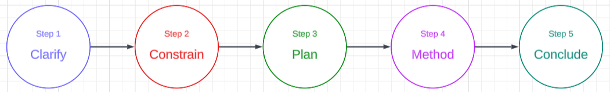

An **open-ended** problem based on a real-life data science project:
- An opening question with 1 to 3 follow-up questions
- **Duration**: 10 to 20 minutes
- **Topics**: Statistics, Machine Learning, AB Testing, Product-Sense
- **Domain**: Company x Team x Role

**Examples**  
Data Scientist, Marketing @ Apple  
- How would you find meaningful segmentations of Apple's customers?

**Response Framework**  
Provide an effective response in 5 steps.

